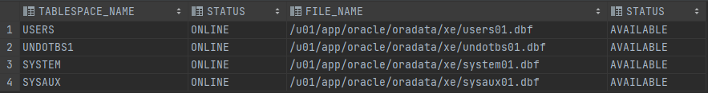
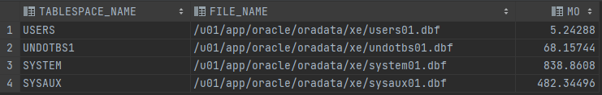
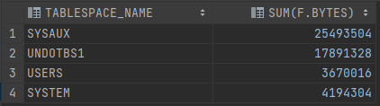
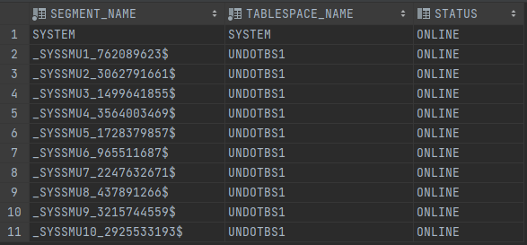

# TP 4

## Dictionnaire

* Le nombre total de vues du dictionnaire de données

```sql
select count(*) from dict;
```

```shell
4592
```

* Le nombre de vues par catégorie (DBA_, USER_, ALL_, V$, "autres")

- DBA_

```sql
select count(*) from dict where table_name like 'DBA_%';
```

```shell
987
```

- USER_

```sql
select count(*) from dict where table_name like 'USER_%';
```

```shell
487
```

- ALL_

```sql
select count(*) from dict where table_name like 'ALL_%';
```

```shell
460
```

- V$

```sql
select count(*) from dict where table_name like 'V$%';
```

```shell
847
```

- Autres

```sql
select count(*) from dict
where
    table_name not like 'DBA_%'
    and table_name not like 'USER_%'
    and table_name not like 'ALL_%'
    and table_name not like 'V$%';
```

```shell
1811
```

* Lister les noms des vues pour les catégories DBA_ et V$

```sql
select table_name from dictionary
where
    table_name like 'DBA_%'
    or table_name like 'V$%'
```

* Lister les noms et objets des vues de la catégorie "autres":

```sql
select table_name from dictionary
where
    table_name not like 'DBA_%'
    and table_name not like 'USER_%'
    and table_name not like 'ALL_%'
    and table_name not like 'V$%';
```

## Tablespaces

* Les tablespaces : nom, état du tablespace ainsi que nom, état des fichiers qui les composent (DBA_TABLESPACES, DBA_DATA_FILES)

```sql
select t.tablespace_name,t.status,f.file_name,f.status from dba_tablespaces t inner join dba_data_files f on t.tablespace_name = f.tablespace_name
```



* La taille totale en Mo de chaque tablespace. L’attribut bytes donne les tailles en octet (DBA_DATA_FILES)

```sql
select tablespace_name, file_name, bytes/1000000 mo from dba_data_files;
```



* La taille totale de la base de données (DBA_DATA_FILES)

```sql
select t.tablespace_name, sum(f.bytes) from dba_tablespaces t 
inner join dba_free_space f on t.tablespace_name = f.tablespace_name
group by t.tablespace_name
```



* L’espace disponible de chaque tablespace (DBA_FREE_SPACE), les rollbacks segments (nom, état, tablespace de mémorisation) (DBA_ROLLBACK_SEGS)

```sql
select segment_name, tablespace_name, status from dba_rollback_segs
```



* Les fichiers redo-log (groupe, nom, état, taille) (`V$LOGFILE`, `V$LOG`)

```sql

```

* Les fichiers de contrôle (nom, état) (V$Controlfile)

```sql

```

* Les caractéristiques de la SGA (System Global Area) (V$SGA)

```sql

```