# TP 4 Jean-Michel REMEUR, Thomas LACAZE

## 1. Dictionnaire

* Le nombre total de vues du dictionnaire de données

```sql
select count(*) from dict;
```

```shell
4592
```

* Le nombre de vues par catégorie (DBA_, USER_, ALL_, V$, "autres")

- DBA_

```sql
select count(*) from dict where table_name like 'DBA_%';
```

```shell
987
```

- USER_

```sql
select count(*) from dict where table_name like 'USER_%';
```

```shell
487
```

- ALL_

```sql
select count(*) from dict where table_name like 'ALL_%';
```

```shell
460
```

- V$

```sql
select count(*) from dict where table_name like 'V$%';
```

```shell
847
```

- Autres

```sql
select count(*) from dict
where
    table_name not like 'DBA_%'
    and table_name not like 'USER_%'
    and table_name not like 'ALL_%'
    and table_name not like 'V$%';
```

```shell
1811
```

* Lister les noms des vues pour les catégories DBA_ et V$

```sql
select table_name from dictionary
where
    table_name like 'DBA_%'
    or table_name like 'V$%';
```

* Lister les noms et objets des vues de la catégorie "autres":

```sql
select table_name from dictionary
where
    table_name not like 'DBA_%'
    and table_name not like 'USER_%'
    and table_name not like 'ALL_%'
    and table_name not like 'V$%';
```

## 2. Tablespaces

* Les tablespaces : nom, état du tablespace ainsi que nom, état des fichiers qui les composent (DBA_TABLESPACES, DBA_DATA_FILES)

```sql
select t.tablespace_name,t.status,f.file_name,f.status from dba_tablespaces t inner join dba_data_files f on t.tablespace_name = f.tablespace_name;
```


* La taille totale en Mo de chaque tablespace. L’attribut bytes donne les tailles en octet (DBA_DATA_FILES)

```sql
select tablespace_name, file_name, bytes/1000000 mo from dba_data_files;
```


* La taille totale de la base de données (DBA_DATA_FILES)

```sql
select t.tablespace_name, sum(f.bytes) from dba_tablespaces t 
inner join dba_free_space f on t.tablespace_name = f.tablespace_name
group by t.tablespace_name;
```


* L’espace disponible de chaque tablespace (DBA_FREE_SPACE), les rollbacks segments (nom, état, tablespace de mémorisation) (DBA_ROLLBACK_SEGS)

```sql
select segment_name, tablespace_name, status from dba_rollback_segs;
```


* Les fichiers redo-log (groupe, nom, état, taille) (`V$LOGFILE`, `V$LOG`)

```sql
select V$LOG.GROUP#, V$LOG.STATUS, MEMBER, BYTES / 100000 mo from V$LOGFILE
inner join V$LOG on V$LOG.GROUP# = V$LOGFILE.GROUP#;
```

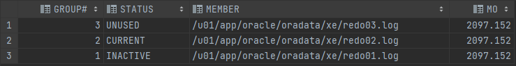

* Les fichiers de contrôle (nom, état) (`V$Controlfile`)

```sql
select NAME, STATUS from V$CONTROLFILE;
```

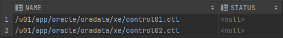

* Les caractéristiques de la SGA (System Global Area) (`V$SGA`)

```sql
select * from V$SGA
```
La SGA est une zone qui permet le partage de données entrent les différents utilisateurs. Toute donnée lue ou modifiée transite par la SGA. Elle est divisée en 6 zones : 

- Cache de tampons de la base de données
- Tampon de journalisation
- Zone de mémoire partagée
- Zone de mémoire Java
- Zone de mémoire LARGE POOL               
- Zone de mémoire Streams                           
 

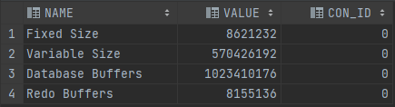

## 3. Initialisation

Les scripts sont stockés dans
le fichiers init.ora associé à l’instance(appelé pfile :
parameter file) dans $ORACLE_home\admin\DB_NAME\pfile 

Dans notre cas `/u01/app/oracle/dbs/init.ora` avec un conteneur Docker :
```ini
db_name='ORCL'
memory_target=1G
processes = 150
audit_file_dest='<ORACLE_BASE>/admin/orcl/adump'
audit_trail ='db'
db_block_size=8192
db_domain=''
db_recovery_file_dest='<ORACLE_BASE>/fast_recovery_area'
db_recovery_file_dest_size=2G
diagnostic_dest='<ORACLE_BASE>'
dispatchers='(PROTOCOL=TCP) (SERVICE=ORCLXDB)'
open_cursors=300 
remote_login_passwordfile='EXCLUSIVE'
undo_tablespace='UNDOTBS1'
# You may want to ensure that control files are created on separate physical devices
control_files = (ora_control1, ora_control2)
compatible ='11.2.0'
```

* Nom de base: db_name

```sql
select * from V$PARAMETER where name = 'db_name';
```

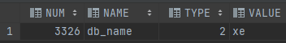

* Nom du service correspondant: service_name

```sql
select * from V$PARAMETER where name LIKE '%_name';
```

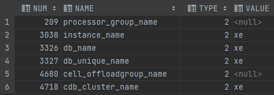


* Taille du bloc de mémoire

```sql
select * from V$PARAMETER where name = 'db_block_size';
```

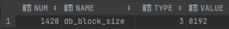

## 4. USER_TABLESPACE

* Afficher les noms de vos tablespaces (USER_TABLESPACES)

```sql
select TABLESPACE_NAME from USER_TABLESPACES;
```

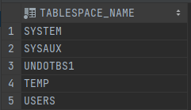

* Créer la table T1(a integer, b varchar2(5)) ; dans le tablespace DATA par exemple. 


Nous avons utilisé le tablespace USERS

```sql
create table T1(
    a integer,
    b varchar2(5)
) tablespace USERS;
```

* Vérifier que la table T1 a bien été créée dans ce tablespace (USER_TABLES)

```sql
select TABLE_NAME, TABLESPACE_NAME from USER_TABLES where TABLE_NAME = 'T1';
```

Nous pouvons bien voir que T1 a bien été crée dans le tablespaces. Donc cela a bien marché !

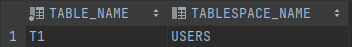

## 5. Caractéristiques tablespace


* Afficher les caractéristiques physiques du tablespace dans lequel ont été créées les tables
(paramètres de la clause storage et espace disponible). Il faut préciser dans la requête
`ALLOCATION_TYPE = USER`

```sql
select DBA_TABLESPACES.TABLESPACE_NAME, SUM(BYTES) BYTES from DBA_TABLESPACES
inner join DBA_FREE_SPACE on DBA_FREE_SPACE.TABLESPACE_NAME = DBA_TABLESPACES.TABLESPACE_NAME
where ALLOCATION_TYPE=USER
GROUP BY DBA_TABLESPACES.TABLESPACE_NAME;
```

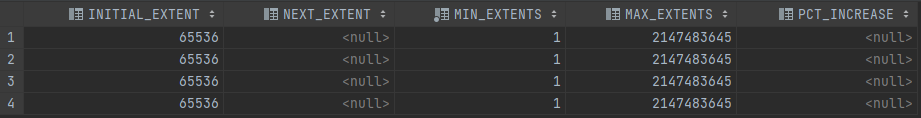

Afficher les caractéristiques physiques des tables créées (initial extent, next_extent,min_extents, max_extents, pct_increase, pct_free, pct_used)

```sql
select INITIAL_EXTENT, NEXT_EXTENT, MIN_EXTENTS, MAX_EXTENTS, PCT_INCREASE from DBA_TABLES;
```

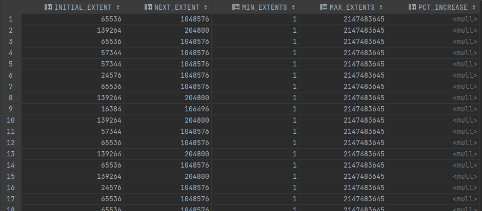

## 6.
* A partir de la table DEPT, créer pour une table TEST contenant plusieurs milliers (7168 par
exemple) d’enregistrements. Afficher les caractéristiques physiques de la table TEST.
Utiliser le CREATE TABLE AS pour la création. Ensuite créer le bloc PL/SQL pour
augmenter le nombre d’enregistrements de la table TEST à partir de la table DEPT;

```sql
create table TEST (
    DEPTNO	integer,
    DNAME	varchar2(20),
    LOC		varchar2(30),
    primary key (DEPTNO)
);
```

Data insertion

```sql
BEGIN
    for i in 1..6969 loop
        INSERT INTO TEST(DEPTNO, DNAME, LOC) VALUES (i, 'TOTO', 'TEUTEU');
    end loop;
end;
```

```sql
select INITIAL_EXTENT, NEXT_EXTENT, MIN_EXTENTS, PCT_INCREASE, PCT_USED, PCT_FREE from DBA_TABLES where TABLE_NAME = 'TEST';
```

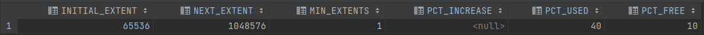

## 7.
* Afficher le nombre d'extents de tous les segments de votre compte. (nom du segment, type,nombre d'extents, taille en bytes). (dba_segments).

```sql
SELECT DBA_EXTENTS.SEGMENT_NAME, DBA_EXTENTS.SEGMENT_TYPE, DBA_SEGMENTS.EXTENTS, DBA_EXTENTS.BYTES FROM DBA_EXTENTS
inner join DBA_SEGMENTS on DBA_EXTENTS.SEGMENT_NAME = DBA_SEGMENTS.SEGMENT_NAME
where DBA_SEGMENTS.OWNER = USER;
```

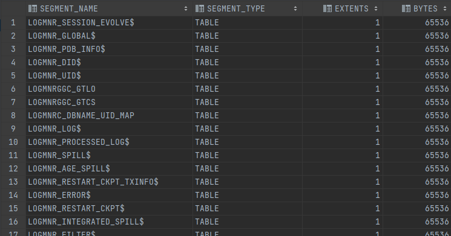

## 8.
Afficher la taille de chaque extent de la table TEST. (Le segment TEST dans dba_extents). Il
faut vérifier que les informations affichées concernent bien votre table TEST et pas toutes les
tables TEST de la base "orcl".

```sql
SELECT DBA_EXTENTS.SEGMENT_NAME, DBA_EXTENTS.BYTES, DBA_EXTENTS.OWNER FROM DBA_EXTENTS
inner join DBA_SEGMENTS on DBA_EXTENTS.SEGMENT_NAME = DBA_SEGMENTS.SEGMENT_NAME
where DBA_SEGMENTS.SEGMENT_NAME = 'TEST'
and DBA_EXTENTS.TABLESPACE_NAME = 'USERS';
```

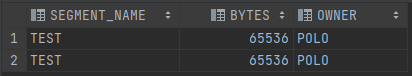

## 9.
Modifier les paramètres physiques de la table TEST de manière que son prochain extend ait
une taille de 200K et un pctincrease de 0.

```sql
ALTER TABLE TEST MOVE TABLESPACE USERS STORAGE(next 200k pctincrease 0);
```

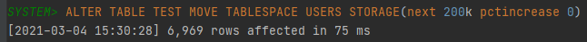

## 10.
Afficher les valeurs de paramètres fournissant le nombre d'enregistrements (num_row), le
nombre de blocs occupés (blocks), le nombre de blocs vides (empty_blocks), pct_free,
pct_used de la table test à partir de la vue dba_tables.

```sql
select NUM_ROWS, BLOCKS, PCT_FREE, PCT_USED from DBA_TABLES where TABLE_NAME = 'TEST';
```

Appliquer la composante ANALYZE à la table TEST de manière à calculer lescaractéristiques physiques de cette table ;
Utiliser la commande : `analyze table test compute statistics`;

```sql
SELECT num_rows, blocks, empty_blocks, avg_space, avg_row_len
FROM user_tables
WHERE table_name ='TEST';

ANALYZE TABLE test COMPUTE STATISTICS;

SELECT num_rows, blocks, empty_blocks, avg_space, avg_row_len
FROM user_tables
WHERE table_name ='TEST';

ANALYZE TABLE test DELETE STATISTICS;

SELECT num_rows, blocks, empty_blocks, avg_space, avg_row_len
FROM user_tables
WHERE table_name ='TEST';

ANALYZE TABLE test ESTIMATE STATISTICS;

SELECT num_rows, blocks, empty_blocks, avg_space, avg_row_len
FROM user_tables
WHERE table_name ='TEST';
```

Modifier le pctfree et le pctused (par exemple 1 et 80 respectivement).

```sql
ALTER TABLE TEST PCTFREE 1;
ALTER TABLE TEST PCTUSED 80;
```

Augmenter la taille de la table test en utilisant le bloc PLSQL de la question 6. 
Revérifier les caractéristiques de stockage de la table test (n’oublier pas de réappliquer la composante ANALYZE).

```sql
BEGIN
    for i in 1..6969 loop
        INSERT INTO TEST(DEPTNO, DNAME, LOC) VALUES (i, 'AL', '<3 you');
    end loop;
end;
```